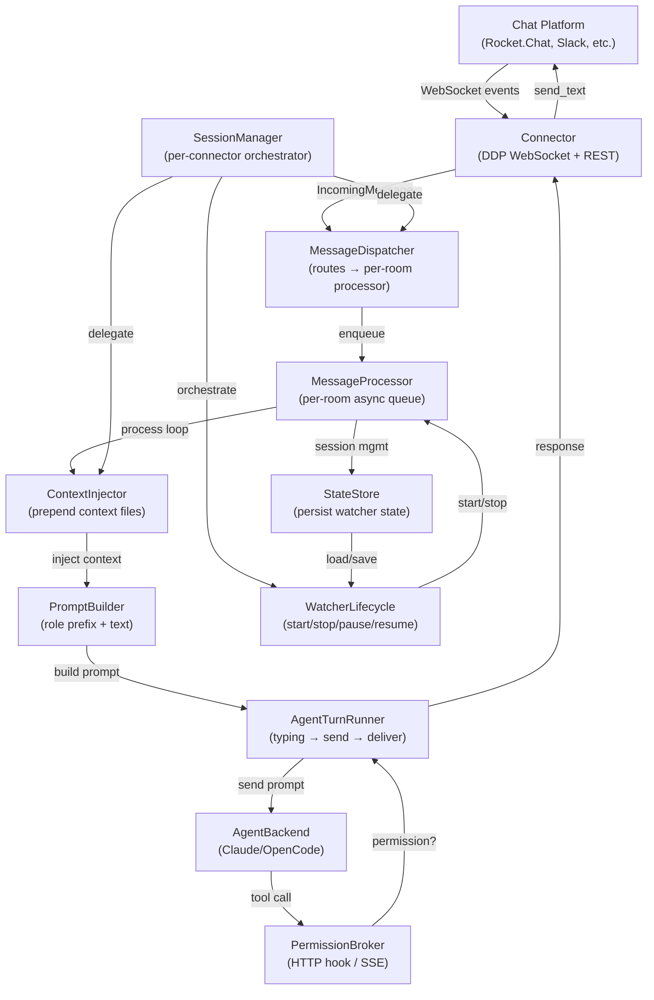

# Agent Chat Gateway Architecture

A comprehensive guide to the internal design of agent-chat-gateway—a standalone Python daemon that bridges chat platforms to AI agent backends with role-based access control and human-in-the-loop tool approval.

**Target audience:** Developers who want to understand the system internals, extend with new connectors or agents, or contribute to the codebase.

---

## System Overview

**agent-chat-gateway** is a long-running daemon that:

1. Connects to chat platforms (Rocket.Chat, and extensible to Slack/Discord/etc.) via platform-specific **Connectors**
2. Routes inbound messages through **per-room message queues** for serial, race-condition-free processing
3. Sends messages to configurable **AI agent backends** (Claude CLI, OpenCode, extensible)
4. Applies **role-based access control** (OWNER/GUEST/ANONYMOUS) to enforce tool allow-lists and require human approval for sensitive operations
5. Posts agent responses back to the chat platform
6. Exposes a **Unix socket CLI control interface** for daemon management (add/stop watchers, check status)

### Key Properties

- **Per-room serial processing** — One async queue per room prevents race conditions
- **Multi-connector support** — Run multiple Rocket.Chat instances (or mixed platforms) in a single daemon
- **Multi-agent support** — Different rooms can use different agent backends
- **Stateful** — Agent sessions and watcher state persist to `~/.agent-chat-gateway/state.<connector>.json`
- **Graceful shutdown** — Drains queues with 30-second grace period before terminating agent subprocesses
- **Security by design** — Roles resolved by connector (never from message content), permission broker is fail-closed (no broker = no watcher start)

---

## Architecture Diagram



---

## Module Structure and Responsibilities

| Module | Purpose | Key Classes/Functions |
|---|---|---|
| **daemon.py** | Unix double-fork daemonization, PID lock, signal handling | `is_running()`, `daemonize()`, `run_daemon()` |
| **cli.py** | argparse CLI entry point (start/stop/restart/status/list/pause/resume/reset/send/onboard/upgrade) | `main()`, command dispatch |
| **service.py** | Top-level orchestrator; wires connectors + agents + permission brokers | `GatewayService`, `AgentRuntimeManager`, `ConnectorEntry` |
| **control.py** | Unix socket ControlServer; routes CLI commands to daemon | `ControlServer`, `handle_cli_command()` |
| **config.py** | YAML loader with env-var expansion and cross-validation | `GatewayConfig`, `AgentConfig`, `PermissionConfig` |
| **runtime_lock.py** | Shared PID file and runtime directory utilities | `RUNTIME_DIR`, `LOCK_FILE`, `acquire()`, `release()` |
| **onboard.py** | Interactive setup wizard for initial configuration | `run_wizard()` |
| **upgrade.py** | Self-upgrade logic for daemon updates | `upgrade_if_needed()` |
| **state.py** | Legacy state compatibility helpers | — |
| **core/connector.py** | Platform-agnostic Connector ABC and normalized message types | `Connector` ABC, `IncomingMessage`, `Room`, `User`, `UserRole` |
| **core/session_manager.py** | Thin orchestrator delegating to collaborators; wires connector + agents + state | `SessionManager` |
| **core/watcher_lifecycle.py** | Watcher state machines (start/pause/resume/reset/stop) | `WatcherLifecycle`, `start_watcher()`, `stop_watcher()` |
| **core/dispatch.py** | Routes inbound messages to per-room processor; intercepts approve/deny | `MessageDispatcher` |
| **core/message_processor.py** | Per-room async queue + orchestration of one turn | `MessageProcessor`, `enqueue()`, `_process()` |
| **core/agent_turn_runner.py** | Execute one agent turn (typing → send → deliver) | `AgentTurnRunner`, `run_turn()` |
| **core/context_injector.py** | Read context files and inject into agent sessions | `ContextInjector` |
| **core/prompt_builder.py** | Pure prompt assembly (no I/O); role-aware prefix | `build_prompt()` |
| **core/attachment_workspace.py** | Per-watcher attachment symlink workspaces | `AttachmentWorkspace`, `localize_attachment_paths()` |
| **core/state_store.py** | Persist WatcherState to JSON; watermark management | `StateStore` |
| **core/state.py** | WatcherState dataclass (session_id, paused, watermark) | `WatcherState` |
| **core/session_maps.py** | Shared routing maps (session → room/role/connector/thread) | `SessionMaps` |
| **core/config.py** | Core config types (CoreConfig, WatcherConfig, etc.) | `CoreConfig`, `WatcherConfig`, `PluginConfig` |
| **core/permission.py** | PermissionBroker ABC (orchestrates state + presenter + notifier) | `PermissionBroker` ABC |
| **core/permission_state.py** | PermissionRequest dataclass, PermissionRegistry in-memory store | `PermissionRegistry`, `PermissionRequest` |
| **core/permission_presenter.py** | Format permission notification messages for users | `format_request_msg()`, `format_timeout_msg()` |
| **core/permission_notifier.py** | Deliver permission notifications to chat rooms with retry | `PermissionNotifier`, `ConnectorPermissionNotifier` |
| **core/expiry_task.py** | Background task: auto-deny timed-out permission requests | `run_expiry_task()` |
| **core/tool_match.py** | Tool allow-list matching (regex + tree-sitter bash AST) | `match_tool()` |
| **core/adapter_utils.py** | Shared helpers (attachment prompt injection) | `format_attachments_for_prompt()` |
| **agents/__init__.py** | AgentBackend ABC (start/stop/create_session/send/create_gateway_broker) | `AgentBackend` ABC, `GatewayBrokerConfig` |
| **agents/response.py** | AgentResponse and TokenUsage dataclasses | `AgentResponse`, `TokenUsage` |
| **agents/session.py** | AgentSession: thin async context manager for scripting | `AgentSession` |
| **agents/errors.py** | Classified exception hierarchy (RateLimited, Permission, Unavailable) | `AgentError`, `AgentRateLimitedError`, etc. |
| **agents/claude/adapter.py** | ClaudeBackend: drives Claude CLI subprocess with stream-json | `ClaudeBackend` |
| **agents/claude/broker.py** | ClaudePermissionBroker: HTTP PreToolUse hook server | `ClaudePermissionBroker` |
| **agents/claude/callable_broker.py** | Callable broker wrapper for AgentSession use | `CallableClaudePermissionBroker` |
| **agents/claude/settings_adapter.py** | Generate temp settings.json with PreToolUse hook URL | `generate_settings_file()` |
| **agents/opencode/adapter.py** | OpenCodeBackend: drives opencode HTTP server | `OpenCodeBackend` |
| **agents/opencode/broker.py** | OpenCodePermissionBroker: SSE listener + reply API | `OpenCodePermissionBroker` |
| **agents/opencode/callable_broker.py** | Callable broker wrapper for AgentSession use | `CallableOpenCodePermissionBroker` |
| **connectors/rocketchat/connector.py** | RocketChatConnector: all RC-specific logic | `RocketChatConnector` |
| **connectors/rocketchat/websocket.py** | DDP WebSocket client (subscriptions, reconnect, keepalive) | `DDPClient` |
| **connectors/rocketchat/rest.py** | RC REST client (login, send, upload, search) | `RocketChatREST` |
| **connectors/rocketchat/normalize.py** | RC DDP doc → IncomingMessage (dedup, attachment download) | `normalize_rc_message()` |
| **connectors/rocketchat/outbound.py** | RC outbound helpers (send_text, typing, online) | `send_message()`, `notify_typing()` |
| **connectors/rocketchat/policy.py** | RC message filtering policy (bot, edits, threads) | `should_process_message()` |
| **connectors/script/connector.py** | ScriptConnector: in-memory connector for tests/scripting | `ScriptConnector` |

---

## Data Flow: From Chat Message to Agent Response

### Complete Message Lifecycle

```
┌─ User sends @mention in Rocket.Chat ─────────────────────┐
│                                                             │
└─→ RC WebSocket DDP event                                   │
    └─→ connectors/rocketchat/websocket.py (DDPClient)       │
        ├─ Subscription updates ("room-messages")            │
        ├─ Download attachments (if enabled)                 │
        ├─ Dedup check (platform message ID)                 │
        └─→ Connector.message_handler callback               │
            └─→ normalize_rc_message()                       │
                └─→ IncomingMessage(                          │
                    id, timestamp, room, sender, role, text, │
                    attachments, raw)                        │
                                                              │
    └─→ SessionManager.run()                                 │
        └─→ MessageDispatcher.dispatch(message)              │
            ├─→ [Intercept approve/deny commands]            │
            │   ├─ PermissionRegistry.resolve()              │
            │   └─ Unblock tool Future                       │
            │                                                 │
            └─→ MessageProcessor.enqueue(message)            │
                └─→ asyncio.Queue.put(message)               │
                                                              │
    └─→ MessageProcessor._process()  [queue consumer loop]   │
        ├─→ ContextInjector.inject()  [if first message]     │
        │   └─ Read ~/.agent-chat-gateway/contexts/*.md      │
        │   └─ Inject into agent session                     │
        │                                                     │
        ├─→ PromptBuilder.build_prompt()                     │
        │   ├─ Trusted header:                               │
        │   │   "[Rocket.Chat #room | from: alice | role:    │
        │   │    owner]"                                     │
        │   ├─ Message text                                  │
        │   └─ Attachment paths                              │
        │                                                     │
        ├─→ AgentTurnRunner.run_turn()                       │
        │   ├─→ notify_typing(True)                          │
        │   │                                                 │
        │   ├─→ AgentBackend.send()                          │
        │   │   └─ Claude:                                   │
        │   │     └─ Spawn: claude -p --resume <id>          │
        │   │        --output-format stream-json             │
        │   │        [--settings <hook_config>]              │
        │   │     └─ Stream JSON events                      │
        │   │     └─ Extract text blocks + metadata          │
        │   │   └─ OpenCode:                                 │
        │   │     └─ HTTP POST /session/{id}/message         │
        │   │     └─ Parse JSON response                     │
        │   │                                                 │
        │   │   ┌─ [If tool call detected] ─────────────┐   │
        │   │   │                                        │   │
        │   │   └─→ PermissionBroker._decide()          │   │
        │   │       ├─ Guest + allowed tool?            │   │
        │   │       │  → auto-allow                     │   │
        │   │       ├─ Guest + denied tool?             │   │
        │   │       │  → auto-deny (no notif)           │   │
        │   │       ├─ Owner + skip_owner_approval?     │   │
        │   │       │  → auto-allow                     │   │
        │   │       ├─ Owner + tool in allow-list?      │   │
        │   │       │  → auto-allow                     │   │
        │   │       └─ Else:                            │   │
        │   │          └─ request_permission()          │   │
        │   │             ├─ Generate 4-char ID        │   │
        │   │             ├─ Register Future            │   │
        │   │             ├─ Post to RC chat:           │   │
        │   │             │   "🔐 Tool: Bash            │   │
        │   │             │    [a3k9]"                  │   │
        │   │             ├─ Pause agent subprocess     │   │
        │   │             ├─ Await owner "approve a3k9" │   │
        │   │             ├─ [Or auto-deny after        │   │
        │   │             │  permissions.timeout]       │   │
        │   │             └─ Unblock → resume           │   │
        │   │                                            │   │
        │   │   └─────────────────────────────────────────┘   │
        │   │                                                 │
        │   ├─→ connector.send_text(response)               │
        │   │   ├─ Chunk by text_chunk_limit               │
        │   │   ├─ POST to RC REST /api/v1/chat.postMessage │
        │   │   └─ or equivalent for other connectors       │
        │   │                                                 │
        │   ├─→ Log token usage (if response.usage)         │
        │   │   "Agent usage [@alice] in=1234 out=256 ..."   │
        │   │                                                 │
        │   └─→ notify_typing(False)                        │
        │                                                     │
        ├─→ Update session state                            │
        │   └─ StateStore.save() to JSON                    │
        │                                                     │
        └─→ Continue loop (dequeue next message or wait)     │
```

### Key Interception Points

1. **Message normalization** — `normalize_rc_message()` runs BEFORE the core sees the message; deduplication, attachment download, role resolution all happen here
2. **Permission interception** — `MessageDispatcher.dispatch()` intercepts "approve" and "deny" commands BEFORE they reach the queue
3. **Tool execution interception** — `PermissionBroker` uses backend-specific hooks (HTTP for Claude, SSE for OpenCode) to pause agent execution mid-turn
4. **Graceful shutdown** — `MessageProcessor.stop()` drains the queue with a 30-second grace period

---

## Key Abstractions and Interfaces

### Connector ABC

All chat platform integrations implement this interface:

```python
class Connector(ABC):
    """Base class for chat platform adapters."""

    @abstractmethod
    async def connect(self) -> None:
        """Establish platform connection."""
        ...

    @abstractmethod
    async def disconnect(self) -> None:
        """Tear down platform connection."""
        ...

    @abstractmethod
    def register_handler(self, handler: Callable[[IncomingMessage], Awaitable[None]]) -> None:
        """Register callback for inbound messages."""
        ...

    @abstractmethod
    async def send_text(self, room_id: str, response: AgentResponse) -> None:
        """Post agent response text to a room."""
        ...

    @abstractmethod
    async def resolve_room(self, room_name: str) -> Room:
        """Look up room metadata by name."""
        ...

    @abstractmethod
    def format_prompt_prefix(self, msg: IncomingMessage) -> str:
        """Return trusted header prefix for prompt."""
        ...
```

**Security principle:** The `format_prompt_prefix()` method must return a server-controlled header that the agent can read but never the message sender can forge. This is the foundation of RBAC.

### AgentBackend ABC

All AI agent integrations implement this interface:

```python
class AgentBackend(ABC):
    """Base class for AI agent backends."""

    @abstractmethod
    async def create_session(
        self,
        working_directory: str,
        extra_args: list[str] | None = None,
        session_title: str | None = None,
    ) -> str:
        """Start a new session. Return opaque session_id."""
        ...

    @abstractmethod
    async def send(
        self,
        session_id: str,
        prompt: str,
        working_directory: str,
        timeout: int,
        attachments: list[str] | None = None,
        env: dict[str, str] | None = None,
    ) -> AgentResponse:
        """Send a message to an existing session.

        Raise asyncio.TimeoutError if timeout exceeded.
        """
        ...

    @abstractmethod
    async def start(self) -> None:
        """Start any backend services (e.g., permission broker server)."""
        ...

    @abstractmethod
    async def stop(self) -> None:
        """Shut down backend services."""
        ...
```

### PermissionBroker ABC

Backend-specific tool interception logic:

```python
class PermissionBroker(ABC):
    """Intercepts tool calls and requests owner approval."""

    @abstractmethod
    async def start(self) -> None:
        """Start background listeners (HTTP server, SSE client, etc.)."""
        ...

    @abstractmethod
    async def stop(self) -> None:
        """Shut down background listeners."""
        ...

    async def request_permission(
        self,
        tool_name: str,
        tool_input: dict,
        session_id: str,
        room_id: str,
        thread_id: str | None = None,
    ) -> bool:
        """Post permission request and block until resolved.

        Returns True if approved, False if denied or timed out.
        """
        ...
```

### IncomingMessage

Normalized message format that the core library receives:

```python
@dataclass
class IncomingMessage:
    id: str                                      # Platform message ID
    timestamp: str                               # ISO 8601
    room: Room                                   # Channel/conversation
    sender: User                                 # Message author
    role: UserRole                               # OWNER/GUEST/ANONYMOUS
    text: str                                    # Message body
    attachments: list[Attachment] = field(default_factory=list)
    raw: dict = field(default_factory=dict)     # Original platform data
```

**Security:** `role` is resolved by the Connector (never by the core). The Connector examines the platform's user record to determine access level.

---

## Role-Based Access Control (RBAC) System

A **4-layer defense-in-depth** approach:

### Layer 1: Role Resolution (Connector)

The Connector maps platform user identity to `UserRole`:

- **OWNER** — Full access to all tools
- **GUEST** — Restricted to tool allow-list from config (e.g., Read, Grep, Glob only)
- **ANONYMOUS** — Rejected at message intake; never reaches queue

```python
# Example: RocketChatConnector
def _get_user_role(self, username: str, room_name: str) -> UserRole:
    if username in self.config.allowed_users.owners:
        return UserRole.OWNER
    if username in self.config.allowed_users.guests:
        return UserRole.GUEST
    return UserRole.ANONYMOUS
```

### Layer 2: Trusted Prompt Prefix (Connector)

The Connector injects a server-controlled header that the agent reads but cannot be forged:

```python
# In RocketChatConnector
def format_prompt_prefix(self, msg: IncomingMessage) -> str:
    return f"[Rocket.Chat #{msg.room.name} | from: {msg.sender.username} | role: {msg.role.value}]"
```

This prefix is **never** sourced from user input or tool output. The agent parses this prefix to determine what the sender is allowed to do.

### Layer 3: Tool Interception (PermissionBroker)

When the agent attempts a sensitive tool call (Bash, Write, Edit, etc.), the permission broker intercepts it:

- **Guests + tool in allow-list** → allow immediately
- **Guests + tool NOT in allow-list** → deny immediately (no owner notification—guest doesn't know the tool exists)
- **Owners + skip_owner_approval** → allow immediately (sandbox mode)
- **Owners + tool in owner_allowed_tools** → allow immediately
- **All others** → post notification, await owner approval

### Layer 4: Tool Parameter Matching (tool_match.py)

Optional fine-grained tool validation using:

- **Regex matching** on tool name and parameters
- **Tree-sitter AST parsing** for Bash commands (safely splits args without shell interpretation)
- **Path normalization** to prevent `../` directory traversal

---

## Permission Workflow

When a tool call requires approval:

```
Agent attempts sensitive tool call
├─ PermissionBroker._decide()
│  ├─ Check guest_allowed_tools (auto-allow or auto-deny)
│  └─ Check owner_allowed_tools (auto-allow or request)
│
├─ request_permission()
│  ├─ Generate 4-char collision-free ID: `a3k9`
│  ├─ PermissionRegistry.register(id) → asyncio.Future
│  ├─ PermissionNotifier.post() to RC chat:
│  │  ```
│  │  🔐 **Permission required** `[a3k9]`
│  │  **Tool:** `Bash`
│  │  **Params:** `command='rm ./build'`
│  │  Reply `approve a3k9` or `deny a3k9`
│  │  ```
│  └─ Start auto-deny timer (permissions.timeout seconds)
│
├─ Agent subprocess blocks (paused at HTTP hook or SSE)
│
├─ Owner types in RC chat: "approve a3k9"
│  ├─ MessageDispatcher.dispatch() intercepts
│  ├─ PermissionRegistry.resolve(id) → True
│  ├─ Future resolved → agent subprocess unblocked
│  └─ Tool executes
│
└─ [Or: No response within timeout]
   ├─ expiry_task auto-denies
   ├─ PermissionRegistry.resolve(id) → False
   ├─ Future resolved → agent subprocess resumes
   └─ Tool is skipped
```

### Approval Command Format

Owners reply with these exact formats (no `/` prefix—that would be intercepted by the RC client):

- `approve a3k9` — Allow the tool call
- `deny a3k9` — Block the tool call

The MessageDispatcher intercepts these commands **before** they reach the message processor queue, so the agent never sees them.

### Concurrency Guarantees

- Only one tool call can be pending approval at a time per room
- While a tool is pending, new messages are queued but not processed
- The `approve` or `deny` command unblocks the queue immediately

---

## Agent Backends

### ClaudeBackend

Drives the Claude CLI via subprocesses.

**Session creation:**
```bash
claude -p \
  --output-format json \
  --agent assistance \
  --session-prefix agent-chat
```
Parses response JSON to extract `session_id`.

**Message sending:**
```bash
claude -p \
  --resume <session-id> \
  --output-format stream-json \
  --verbose \
  [--settings <path>]  # injected when permissions enabled
```

Streams one JSON object per line; extracts text from content blocks and metadata (tokens, cost, duration).

**Permission handling:** When permissions enabled, a temporary `settings.json` file is generated with an HTTP hook URL and passed via `--settings`. Claude CLI calls the hook before executing sensitive tools.

**Environment isolation:** Strips `CLAUDECODE` from subprocess environment; injects `ACG_ROLE` and `ACG_ALLOWED_TOOLS` for per-message RBAC.

### OpenCodeBackend

Drives the opencode CLI.

**Session creation:**
```bash
opencode run --format json <new_session_args>
```

**Message sending:**
```bash
opencode run -s <session-id> --format json [-f <file> ...]
```

**Permission handling:** Uses opencode's native `permission.asked` SSE events triggered by the `role-enforcement.ts` plugin. The plugin sets `output.status = "ask"` on sensitive tool calls, firing the SSE event.

**Attachments:** Native `-f` flag support (unlike Claude which requires inline path injection).

---

## Configuration and Startup/Shutdown

### Configuration Hierarchy

```
config.yaml (user-editable)
    ├─ connectors: [RocketChatConfig, ...]
    ├─ agents: [AgentConfig, ...]
    ├─ timeout: 360
    ├─ default_agent: "assistance"
    └─ plugins: [PluginConfig, ...]
         → GatewayConfig (validated dataclass)
            → AgentConfig, ConnectorConfig, PermissionConfig
                → CoreConfig (passed to SessionManager)
```

All fields support env-var expansion via `$VARIABLE` syntax.

### Startup Sequence

```
daemon.py:daemonize()
├─ Fork twice (true daemon)
├─ Acquire PID lock (~/ag-cg/gateway.pid)
├─ Redirect stdout/stderr to ~/ag-cg/gateway.log
└─ Call service.py:GatewayService(config)

GatewayService.__init__()
├─ Parse config.yaml → GatewayConfig
├─ Instantiate AgentRuntimeManager
├─ Instantiate per-Connector SessionManager
└─ Instantiate ControlServer (Unix socket)

GatewayService.run()
├─ AgentRuntimeManager.start_all()
│  ├─ Start agent backends (subprocesses, etc.)
│  └─ Start permission brokers (HTTP servers, SSE listeners)
├─ run_once()
│  ├─ Connector.connect() [DDP WebSocket, etc.]
│  └─ SessionManager.run_once() [resume persisted watchers]
└─ ControlServer.run() [accept CLI commands]
```

**Startup ordering rationale:**
1. Backends first — need to be running before messages arrive
2. Permission brokers second — only if backend succeeded
3. Session managers third — can now safely dispatch messages to agents
4. Control socket last — ready to accept CLI commands

### Shutdown Sequence (Reverse Order)

```
Signal: SIGTERM

daemon.py:_signal_handler()
├─ Set shutdown flag
└─ Call service.py:GatewayService.stop()

GatewayService.stop()
├─ ControlServer.stop()
├─ SessionManager.stop()  [all connectors]
│  └─ For each active MessageProcessor:
│     ├─ Enqueue _DRAIN_SENTINEL
│     ├─ Wait up to 30 seconds for queue drain
│     └─ Cancel remaining tasks
├─ AgentRuntimeManager.stop_all()
│  ├─ SIGTERM agent subprocesses
│  └─ SIGKILL after 5-second grace
└─ Release PID lock

daemon.py:_exit()
```

**Grace period:** 30 seconds for message queues to drain before force-killing agents. This allows in-flight tool calls to complete or timeout naturally.

---

## State Persistence

All state files live in `~/.agent-chat-gateway/`:

| File | Contents |
|---|---|
| `gateway.pid` | Process ID of running daemon |
| `gateway.log` | All daemon output (append mode) |
| `control.sock` | Unix domain socket for CLI commands |
| `state.<connector>.json` | Per-connector watcher state (session_id, paused, watermark) |
| `<room>_<session>.lock` | Per-watcher lock file (prevents duplicate sessions) |

### WatcherState JSON

```json
{
  "watchers": [
    {
      "id": "watcher-abc123",
      "room_name": "agent-testing",
      "agent_name": "assistance",
      "session_id": "s-rc4d91a9",
      "working_directory": "/path/to/project",
      "paused": false,
      "watermark": "1234567890000",
      "context_files": ["README.md", "ARCHITECTURE.md"]
    }
  ]
}
```

- **watermark** — Last processed message timestamp; used to skip duplicates on restart
- **paused** — If true, messages are queued but not processed
- **session_id** — Opaque string from agent backend; used to resume sessions

---

## Design Principles

### 1. **Separation of Concerns**

Each module has a single responsibility:

- **SessionManager** — delegates to collaborators, never implements business logic
- **MessageDispatcher** — routes to per-room processor; intercepts commands
- **MessageProcessor** — queue orchestration and session bookkeeping
- **AgentTurnRunner** — single turn execution (prompt → agent → reply)
- **ContextInjector** — context file I/O
- **PromptBuilder** — prompt assembly (no I/O, pure function)
- **StateStore** — persistence (no business logic)

### 2. **Platform Agnosticism**

The core library (`gateway/core/`) never imports anything platform-specific. It only uses the normalized types from `core/connector.py` and `agents/response.py`. This makes adding new connectors or agents trivial.

### 3. **Connector Ownership of Security Decisions**

The connector is responsible for:

- Resolving user role (OWNER/GUEST/ANONYMOUS)
- Implementing `format_prompt_prefix()` with server-controlled header
- Handling attachment downloads
- Deduplicating messages

The core never touches raw platform user data or makes RBAC decisions.

### 4. **Fail-Closed Permission System**

If a permission broker cannot start, the daemon refuses to start watchers. This prevents messages reaching an agent with no tool approval layer active.

```python
if agent_cfg.permissions.enabled and not broker:
    raise RuntimeError(f"Permission broker failed for agent {agent_name}")
```

### 5. **Per-Room Serial Processing**

One async queue per `(connector, room)` pair ensures:

- No race conditions on session state
- Predictable ordering of messages
- Simple message deduplication (watermark check)

### 6. **Dependency Injection**

Collaborators are passed to SessionManager, MessageProcessor, etc., not instantiated internally. This enables:

- Testability (mock connectors, agents, brokers)
- Flexible composition (different agents per room)
- Isolation (no global state)

### 7. **Graceful Degradation**

If an agent backend or permission broker fails at startup:

- Log the error
- Mark the agent as unavailable
- Refuse CLI requests to use that agent
- Continue with other agents

If a connector fails mid-run:

- Log the error
- Stop all watchers for that connector
- Attempt reconnection with exponential backoff

---

## Extending the Gateway

### Adding a New Connector

Implement `Connector` ABC:

```python
from gateway.core.connector import Connector, IncomingMessage, Room, User, UserRole

class DiscordConnector(Connector):
    async def connect(self) -> None:
        # Connect to Discord API / WebSocket
        ...

    async def disconnect(self) -> None:
        # Tear down connection
        ...

    def register_handler(self, handler) -> None:
        # Store handler, call it on inbound messages
        ...

    async def send_text(self, room_id: str, response: AgentResponse) -> None:
        # POST response to Discord channel
        ...

    async def resolve_room(self, room_name: str) -> Room:
        # Look up room metadata
        ...

    def format_prompt_prefix(self, msg: IncomingMessage) -> str:
        return f"[Discord #{msg.room.name} | from: {msg.sender.username} | role: {msg.role.value}]"
```

Register in `service.py`:

```python
def connector_factory(cfg: ConnectorConfig) -> Connector:
    if cfg.type == "discord":
        return DiscordConnector(config=cfg.discord)
    ...
```

Add to `config.yaml`:

```yaml
connectors:
  - name: discord-main
    type: discord
    server:
      bot_token: "$DISCORD_TOKEN"
    allowed_users:
      owners:
        - alice
```

### Adding a New Agent Backend

Implement `AgentBackend` ABC:

```python
from gateway.agents import AgentBackend

class AnthropicAPIBackend(AgentBackend):
    async def create_session(self, working_directory, extra_args=None, session_title=None) -> str:
        # POST to Anthropic API, return session_id
        ...

    async def send(self, session_id, prompt, working_directory, timeout, attachments=None, env=None) -> AgentResponse:
        # POST message to API, stream response, return AgentResponse
        ...

    async def start(self) -> None:
        ...

    async def stop(self) -> None:
        ...
```

Register in `service.py`:

```python
def _build_agent_backend(agent_cfg: AgentConfig) -> AgentBackend:
    if agent_cfg.type == "anthropic-api":
        return AnthropicAPIBackend(...)
    ...
```

Add to `config.yaml`:

```yaml
agents:
  research:
    type: anthropic-api
    api_key: "$ANTHROPIC_API_KEY"
    model: claude-3-opus-20240229
    new_session_args: []
```

---

## Testing and Scripting

### ScriptConnector

For unit tests and scripting without network I/O:

```python
from gateway.connectors.script.connector import ScriptConnector
from gateway.core.session_manager import SessionManager
from gateway.core.config import CoreConfig

# In-memory connector with no network calls
connector = ScriptConnector()

# Configure agent backend
from gateway.agents.claude.adapter import ClaudeBackend
agent = ClaudeBackend(command="claude", new_session_args=[], timeout=60)
agents = {"default": agent}

# Create session manager
config = CoreConfig(timeout=60, agents=agents, default_agent="default")
manager = SessionManager(connector, agents, "default", config)

# Simulate conversation
async def test_agent():
    await manager.run_once()
    await manager.add_session("test-room", None, "/tmp")
    await connector.inject("Hello, what's in this directory?")
    reply = await connector.receive_reply()
    print(reply.text)
```

### AgentSession

For one-off scripting without the full gateway stack:

```python
from gateway.agents.session import AgentSession
from gateway.agents.claude.adapter import ClaudeBackend

async with AgentSession(
    ClaudeBackend("claude", ["--agent", "assistance"], 120),
    cwd="/my/project"
) as session:
    response = await session.send("Summarize the codebase")
    print(response)  # __str__ returns response.text
```

---

## Troubleshooting Guide

### Daemon won't start

Check `~/.agent-chat-gateway/gateway.log` for errors. Common issues:

1. **Config YAML syntax error** — Run `python -m yaml config.yaml` to validate
2. **Agent binary missing** — Ensure Claude CLI or opencode is in PATH
3. **Port already in use** — Permission broker HTTP server conflicts; check netstat
4. **Permission denied** — Ensure daemon can write to `~/.agent-chat-gateway/`

### Messages not being processed

1. **Check if watcher is running** — `agent-chat-gateway list`
2. **Check if watcher is paused** — `agent-chat-gateway list -v`
3. **Check daemon logs** — `tail -f ~/.agent-chat-gateway/gateway.log`
4. **Check connector logs** — Filter by `connectors.rocketchat` in logs

### Permission requests timing out

1. **Approval command syntax** — Type `approve a3k9` (no slash)
2. **Check permission timeout config** — Must be < global timeout
3. **Check if broker is running** — Look for HTTP server on port in logs

### Agent crashes or hangs

1. **Check agent subprocess logs** — `claude` or `opencode` may have internal errors
2. **Increase timeout** — `timeout: 600` in config
3. **Check working directory** — Agent must be able to cd into it

---

## Performance Considerations

### Message Throughput

- Per-room serial processing means room is blocked while agent is responding
- Multiple rooms process in parallel (separate queues)
- Typical bottleneck is agent subprocess latency (5-30 seconds per message)

### Memory Usage

- One async task per room (message consumer)
- One subprocess per active agent session
- Permission registry stores pending requests in memory (cleared after resolution)
- State files are small (< 10 KB per watcher typically)

### Scaling

- **Horizontal:** Run multiple daemon instances on different connectors
- **Vertical:** Increase max file descriptors for many rooms: `ulimit -n 8192`

---

## Security Model

### Threat Model

1. **Malicious chat user** — Tries to craft messages that trick the agent into dangerous actions
   - **Defense:** Role prefix is server-injected, never user-controllable

2. **Compromised chat platform account** — Account hijacked to impersonate owner
   - **Defense:** RBAC is connector-level (resolve role from platform user record), not message content

3. **Tool injection via agent output** — Agent outputs a tool call in response text
   - **Defense:** Permission broker intercepts actual tool execution before it occurs

4. **Path traversal in attachments** — User uploads symlink to /etc/passwd
   - **Defense:** Connector downloads to isolated workspace, agent sees only local paths

### Isolation Guarantees

- **Chat platform isolation** — Each connector runs independently; breach of one doesn't affect others
- **Session isolation** — Agent sessions don't share history; each room has its own session
- **Filesystem isolation** — Working directory is per-watcher; agent can't escape (modulo agent's own sandbox)

---

## Summary

agent-chat-gateway provides a modular, extensible bridge between chat platforms and AI agents with enterprise-grade RBAC and approval workflows. Its architecture emphasizes:

- **Modularity** — Swap connectors and agents without touching core logic
- **Security** — Defense-in-depth via role resolution, prompt injection, broker interception, and path normalization
- **Reliability** — Graceful degradation, state persistence, and queue draining on shutdown
- **Simplicity** — Minimal dependencies, focused modules, clear interfaces

The system is designed for contributions: adding a new connector or agent requires implementing one ABC and registering it—no changes to core libraries needed.

